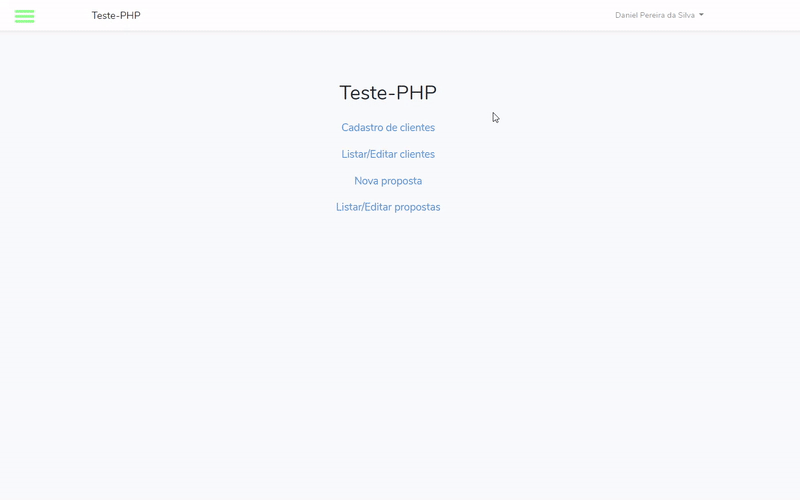

<h1 align="center">TESTE-PHP</h1>

Site feito utilizando Laravel. O objetivo do site é cadastrar clientes e cadastrar propostas atreladas a esses clientes. Junto com outras  funcionalidades.

 
Link para o projeto: 
http://ttest-php.herokuapp.com

